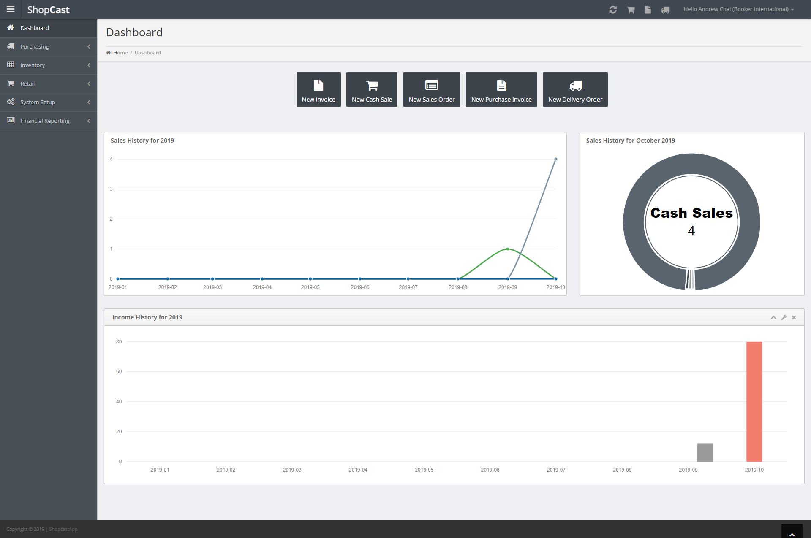
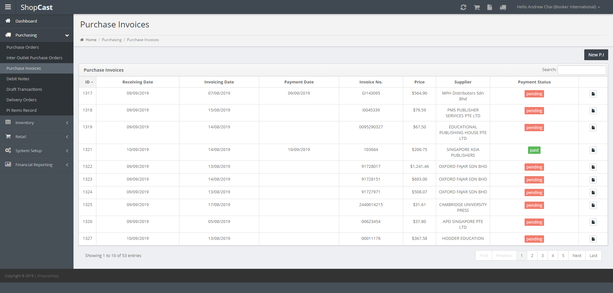

# ShopCast booker
This is ShopCast admin panel written in CodeIgniter PHP Framework.

## This is production mode project, so to run in development mode on your local, do something below.

### index.php
line 21: define('ENVIRONMENT', 'development');
line 36: error_reporting(E_ALL & ~E_NOTICE);

### application\config\database.php
line 52: $db['default']['username'] = 'root';
line 53: $db['default']['password'] = '';
line 55: $db['default']['dbdriver'] = 'mysqli';
line 61: $db['default']['char_set'] = 'utf8';
line 62: $db['default']['dbcollat'] = 'utf8_general_ci';

## database
shopcast_booker.zip

## user login
andrew
123456

## reference
c:\xampp\php\php.ini
